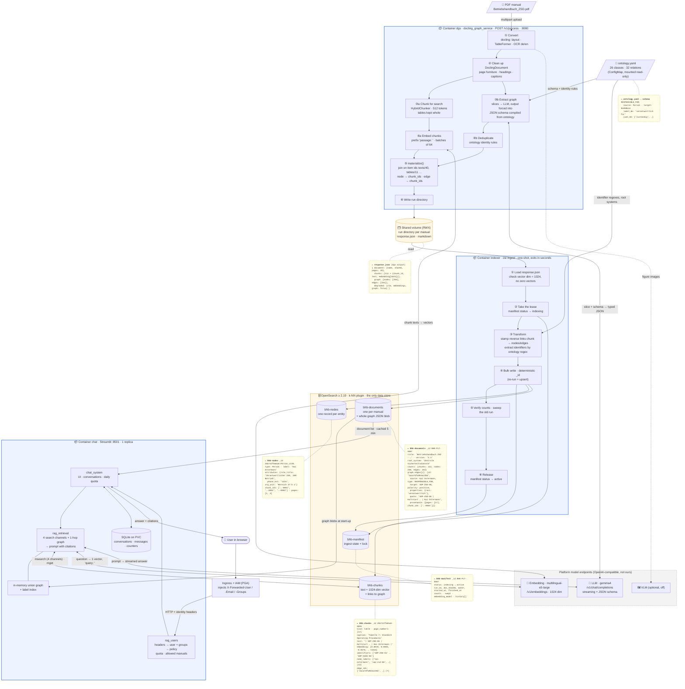
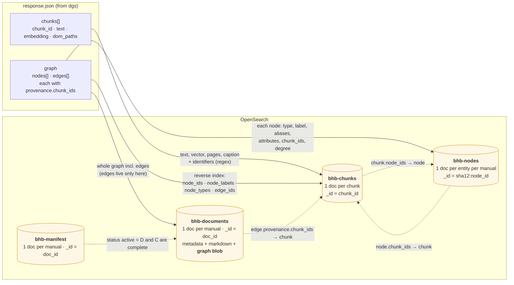

# Architecture & Data Flow — Ingest and Storage

How a PDF manual becomes searchable text, vectors and a knowledge graph in OpenSearch, and which
container does what. This follows the **target deployment in [`technical_request.md`](technical_request.md)**
(§1, §2, §5, §9). Where the code differs today, see [Plan vs. current](#plan-vs-current) at the end.
The question path is covered in [`RETRIEVAL-FLOW.md`](RETRIEVAL-FLOW.md).

All example records (the 💬 bubbles and the samples in §3) are **real data** from the ZSD run
(`BHB-PLT-0007`, `out/remote-zsd/response.json`), shortened with `…`.

---

## 1. The whole system

The platform provides OpenSearch and the model endpoints. We deliver three units: **chat**, **dgs** and
the **indexer**. The indexer is a one-shot container: it runs once per manual and then exits.



### What each container takes in and gives out

| Container | Inputs | Steps (high level) | Outputs | Writes to |
|---|---|---|---|---|
| **dgs** | PDF · `ontology.yaml` · LLM, Embedding (and optional VLM) endpoints | convert → clean up → **fork**: (a) chunk + embed, (b) extract graph under the ontology schema → join the two on item ids | **two products in one `response.json`:** ① chunks with vectors, ② the graph JSON (nodes + edges, each with provenance) | shared volume only, **never OpenSearch** |
| **indexer** | the run directory · `ontology.yaml` | validate → lease → stamp reverse links → bulk upsert → verify → sweep old run → release | 4 kinds of records | OpenSearch (the **only** writer) |
| **OpenSearch** | bulk writes from the indexer | stores and searches (BM25 with German analyzer, k-NN HNSW, keyword term) | search hits, documents by id | — |
| **chat** | user question + identity headers · reads OpenSearch · Embedding + LLM | policy → rewrite → retrieve → prompt → stream (see [`RETRIEVAL-FLOW.md`](RETRIEVAL-FLOW.md)) | answer with citations `[BHB-PLT-0007 S. 17]` | SQLite (conversations only); read-only on OpenSearch |

**Why dgs does not write to OpenSearch:** it keeps the trust split clean. dgs talks to the model
endpoints and holds no database credentials, and only the indexer holds write rights (§8.2 of the
technical request). It also makes the expensive step (2–5 min, LLM) reusable: re-indexing a manual
from its run directory takes seconds and needs no model.

---

## 2. How the two dgs outputs are stored and linked in OpenSearch

dgs produces **chunks + vectors** and **the graph JSON**. The indexer splits that into four indices
and writes the links in **both directions**, so a search hit leads into the graph and a graph fact
leads back to the page that proves it.



| Index | One record = | Key fields | Queried by the chat how |
|---|---|---|---|
| `bhb-chunks` | one searchable passage or whole table | `text`, `body_text`, `caption` (BM25, `de_text` analyzer) · `embedding` (knn_vector 1024, HNSW, lucene) · `identifiers`, `node_labels` (keyword, verbatim) · `node_ids`, `edge_ids` · `doc_id`, `page_numbers`, `heading_breadcrumb` | 4 channels in one `msearch`; `mget` by id for graph provenance |
| `bhb-nodes` | one entity in one manual | `type`, `label`, `aliases`, `attributes`, `identity_norm`, `chunk_ids`, `pages`, `degree` | inspection / `osi search`. The chat works from the graph blob in memory. |
| `bhb-documents` | one manual | `title`, `version`, `root_system`, `counts`, `embedding_model`, `markdown`, **`graph`** (nodes + edges with ids) | read once at start-up → in-memory union graph + label index; document list for the sidebar |
| `bhb-manifest` | the ingest state of one manual | `status` (`indexing` / `active` / `failed`), `run_id`, `doc_sha256`, `owner`, `counts`, `history` | the lock between indexer runs. It tells the chat that a manual is complete. |

**Edges have no index of their own.** They are stored in the graph blob of `bhb-documents` and
referenced by id from every chunk that proves them (`edge_ids`). The chat never searches edges. It
loads them into memory and walks them.

---

## 3. The records, in full

### 3.1 One chunk in `bhb-chunks`

```jsonc
{
  "chunk_id": "2bb722f565a0-0055",          // sha256(pdf)[:12] - running index → stable across runs
  "doc_id": "BHB-PLT-0007",  "run_id": "…",  "indexed_at": "2026-09-…",
  "kind": "table",
  "heading_breadcrumb": ["5 Betrieb", "5.5 Standard Operating Procedures"],
  "caption": "Tabelle 7: Standard Operating Procedures",
  "page_numbers": [17],
  "dom_paths": ["#/texts/339", "#/tables/11"],   // DoclingDocument item ids = the join key
  "token_count": 412,
  "text": "5 Betrieb\n5.5 Standard Operating Procedures\nTabelle 7: …\n| SOP | Titel | Auslöser | Verantwortlich | Dauer | Abstimmung |\n…\n| SOP-ZSD-06 | Kaltstart der Sicherheitsdienste | Notfall, Stromabschaltung, Wiederanlauf | Kai Ostermann | 90 min bis Schritt 7 | Reihenfolge nach SOP-CAAS-06 |",
  "embedding": [0.0019056769, 0.00029982728, -0.05702861, 0.026187675, "… 1024 floats"],
  "embedding_model": "intfloat/multilingual-e5-large",
  "identifiers": ["SOP-CAAS-06", "SOP-ZSD-01", "SOP-ZSD-02", "…", "SOP-ZSD-06"],
  "node_ids":    ["Person_c148c1f00683d662", "Procedure_05f570dc41890cfe", "… 14 nodes"],
  "node_labels": ["kai ostermann", "keycloak", "marcel ebert", "sop-zsd-06", "…"],
  "node_types":  ["ImpactStatement", "Person", "Procedure", "System"],
  "edge_ids":    ["2aca7dfa9b3a135b", "332792a2901cf812", "… 7 edges"]
}
```

`text`/`embedding` come from dgs output ①. `node_*`/`edge_ids` are the **reverse index** that the
indexer derives from output ②. `identifiers` are extracted by the indexer with the ontology's regexes.

### 3.2 One node in `bhb-nodes`

```jsonc
{
  "_id": "2bb722f565a0:Person_c148c1f00683d662",
  "doc_id": "BHB-PLT-0007",
  "node_id": "Person_c148c1f00683d662",  "type": "Person",  "label": "Kai Ostermann",  "aliases": [],
  "attributes": { "role_title": "Verantwortlicher ZSD, IAM-Betrieb", "phone_ext": "1315",
                  "email": "iam-betrieb@bavd.bund.de", "org_unit": "Bereich IT-S 1" },
  "quote": "Kai Ostermann (Bereich IT-S 1, Durchwahl 1315)",
  "chunk_ids": ["2bb722f565a0-0001", "2bb722f565a0-0002", "2bb722f565a0-0003"],
  "pages": [1, 2],  "match": "verbatim",  "degree": 4
}
```

### 3.3 One manual in `bhb-documents` (with one edge of its graph blob)

```jsonc
{
  "doc_id": "BHB-PLT-0007",  "name": "Betriebshandbuch_ZSD.pdf",  "pages": 29,  "tables": 22,
  "title": "Betriebshandbuch ZSD - Zentrale Sicherheitsdienste",  "version": "2.3",
  "root_system": "Zentrale Sicherheitsdienste",
  "counts": { "chunks": 112, "nodes": 250, "edges": 154, "documents": 1 },
  "embedding_model": "intfloat/multilingual-e5-large",  "embedding_dim": 1024,
  "markdown": "BETRIEBSHANDBUCH\n\n## ZSD - Zentrale Sicherheits­ dienste …",
  "graph": {
    "nodes": [ "… 250 × {id, type, label, attributes, aliases, quote, provenance}" ],
    "edges": [
      { "id": "2aca7dfa9b3a135b",
        "source": "Person_c148c1f00683d662",      // Kai Ostermann
        "type": "RESPONSIBLE_FOR",
        "target": "Procedure_05f570dc41890cfe",   // SOP-ZSD-06 Kaltstart der Sicherheitsdienste
        "polarity": "positive",  "qualifier": null,
        "properties": { "raci": "verantwortlich", "is_deputy": false },
        "quote": "SOP-ZSD-06 | Kaltstart der Sicherheitsdienste | Notfall, Stromabschaltung, Wiederanlauf | Kai Ostermann",
        "provenance": { "pages": [17], "chunk_ids": ["2bb722f565a0-0055"] } }
    ],
    "meta": { "ontology": {"name": "bavd-ops-manual-ontology", "version": "1.0.0"}, "…": "…" }
  },
  "degraded": { "vlm": false, "embeddings": false, "graph": false }
}
```

### 3.4 The ingest record in `bhb-manifest`

```jsonc
{
  "doc_id": "BHB-PLT-0007",
  "status": "active",                       // indexing → active   (or → failed, with "error")
  "run_id": "…", "previous_run_id": "…",    // same run_id again = no-op
  "doc_sha256": "2bb722f565a0ff49…", "doc_name": "Betriebshandbuch_ZSD.pdf",
  "owner": "<hostname>:<pid>", "started_at": "…", "finished_at": "…",
  "counts": { "chunks": 112, "nodes": 250, "edges": 154, "documents": 1 },
  "swept": { "chunks": 0, "nodes": 0 },     // records of the previous run removed
  "embedding_model": "intfloat/multilingual-e5-large",
  "history": [ { "run_id": "…", "replaced_at": "…" } ]
}
```

---

## Plan vs. current

| Plan (`technical_request.md`) | Code today (2026-09-30) |
|---|---|
| Chat notices a new manual within ~5 min, **document list and in-memory graph** refresh without restart (§1, §9) | Document list: yes, `Catalog` caches `bhb-documents` for 300 s. Graph: `Retriever.reload_graph()` exists, but nothing in the chat calls it on a timer or on the manifest yet, so the graph is loaded at start-up only. |
| Chat polls the **manifest** for `active` | The chat reads `bhb-documents` directly; the manifest is used by the indexer only. |
| dgs → indexer as two operator steps (§9) | As planned (`osi ingest <run-dir>`). Self-service upload from the chat (flow 7) is an open scope decision (§10 #6). |
| Embedding `multilingual-e5-large` everywhere | The three prototype manuals are still `bge-m3` and are re-indexed before go-live (§3.1). |
