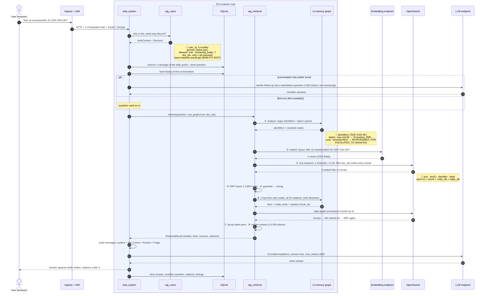
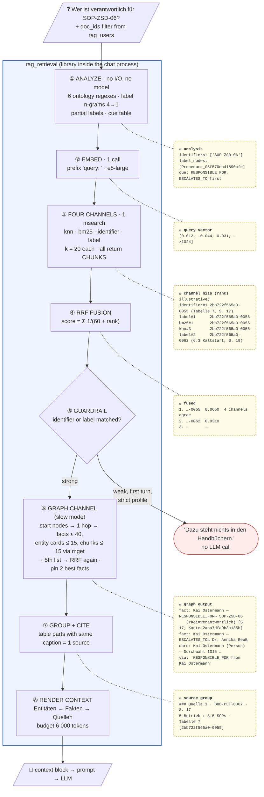
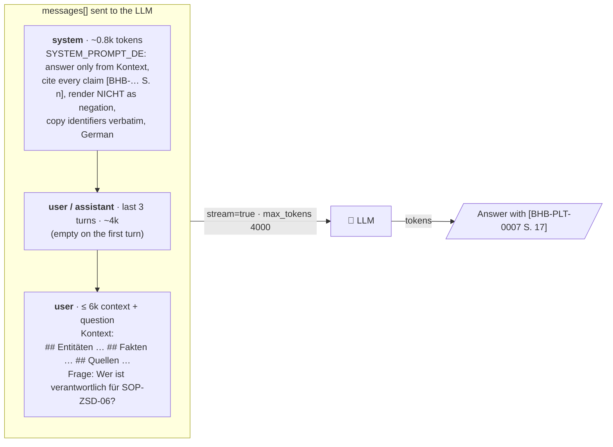

# Retrieval Flow — "Wer ist verantwortlich …?"

What happens inside the **chat** container between a question and the streamed answer, and what data
the LLM finally receives. This follows the target design in [`technical_request.md`](technical_request.md)
and the mechanism in [`MECHANISMS.md`](MECHANISMS.md) (Mechanism B). Ingest and storage are in
[`ARCHITECTURE-DATAFLOW.md`](ARCHITECTURE-DATAFLOW.md).

**Example question:** `Wer ist verantwortlich für SOP-ZSD-06?`

The chunks, nodes, edges, quotes and page numbers below are **real data** from the indexed ZSD manual
(`BHB-PLT-0007`). The **channel ranks and scores are illustrative**: they show the shape of a run and
were not captured from a live trace. Variants of the question (no system named, no identifier, a
follow-up) are in [§4](#4-variants-of-the-question).

Key point: **no language model is involved before the final call.** Identifiers are found by regex,
entities by string match, similarity by an encoder, and ranking by arithmetic. The LLM sees only the
assembled context and writes the answer.

---

## 1. The sequence: who calls whom



---

## 2. Inside `rag_retrieval`: the eight steps and the data between them



### Step by step, for this question

| Step | What happens | Result for "Wer ist verantwortlich für SOP-ZSD-06?" |
|---|---|---|
| **① Analyze** | Regexes from the ontology find IDs. Question n-grams are looked up in the label index (built at start-up from every label and alias of all manuals). A cue table maps question words to relations. | `SOP-ZSD-06` is an identifier **and** a node label → start node `Procedure_05f570dc41890cfe`. `verantwortlich` → rank `RESPONSIBLE_FOR`, `ESCALATES_TO` facts first. |
| **② Embed** | One call to the embedding endpoint with the `query: ` prefix. This is the only network call before the search. | 1 vector, 1024 dimensions |
| **③ Four channels** | A single `msearch`. The user's `doc_ids` filter sits **inside** every clause (inside the k-NN clause too), so a restricted user never sees other manuals' chunks. | The **identifier** channel (`term` on `identifiers`) and the **label** channel (`term` on `node_labels`) both hit chunk `…-0055` (Tabelle 7), because the indexer stamped `SOP-ZSD-06` onto that chunk. BM25 and k-NN find it on wording and meaning. |
| **④ RRF** | Ranks only, never scores: `Σ 1/(60 + rank)`. Agreement across channels beats one strong hit. | `…-0055` found by 4 channels → rank 1 |
| **⑤ Guardrail** | Strong if an identifier matched or a label resolved. Weak otherwise (no hits, or no top-3 chunk found by ≥ 2 search channels). | **strong**: identifier + label matched |
| **⑥ Graph** | Start nodes = resolved labels + `node_ids` of the top chunks. One hop over all relations. Facts are rendered with polarity, properties, quote and page. Their provenance chunks are fetched by `mget` and fused as a 5th list. | `Kai Ostermann —RESPONSIBLE_FOR→ SOP-ZSD-06`. Because chunk `…-0055` seeds Kai Ostermann too, his other edges come in as well (SOP-ZSD-02, -03, escalation to Dr. Annika Reuß, p. 26). |
| **⑦ Group** | Table parts sharing document + caption → one source with a page range | Tabelle 7 = Quelle 1 |
| **⑧ Render** | Entities, then facts, then sources by rank until 6 000 tokens are used. Facts and entities always fit first. | the context block in §3 |

---

## 3. What the LLM actually receives

The chat sends an OpenAI-style `messages` array to `/v1/chat/completions` (`stream: true`,
`max_tokens: 4000`, thinking switched off via `extra_body`). Before sending, it checks the total
against `RAG__LLM__CONTEXT_LIMIT_TOKENS` (32 000) and drops the oldest history turns if needed.



### The final user message, rendered (abridged)

```text
Kontext:
## Entitäten
- SOP-ZSD-06 (Procedure) — sop_id: SOP-ZSD-06; title: Kaltstart der Sicherheitsdienste; trigger: notfall [BHB-PLT-0007 S. 17, 19]
- Kai Ostermann (Person) — role_title: Verantwortlicher ZSD, IAM-Betrieb; phone_ext: 1315; email: iam-betrieb@bavd.bund.de; org_unit: Bereich IT-S 1 [BHB-PLT-0007 S. 1, 2]
- Dr. Annika Reuß (Person) — role_title: Bereichsleitung IT-S (Eskalationsstufe 2); phone_ext: 1300; org_unit: Bereich IT-S [BHB-PLT-0007 S. 25, 26, 27, 28]
- …

## Fakten
- Kai Ostermann —RESPONSIBLE_FOR (verantwortlich für)→ SOP-ZSD-06 (raci=verantwortlich, is_deputy=False) — „SOP-ZSD-06 | Kaltstart der Sicherheitsdienste | Notfall, Stromabschaltung, Wiederanlauf | Kai Ostermann“ [BHB-PLT-0007 S. 17; Kante 2aca7dfa9b3a135b]
- Kai Ostermann —ESCALATES_TO (eskaliert an)→ Dr. Annika Reuß (level=2) [Sev-1 über 2 Stunden, Break-Glass, Sperrung eines produktiven Zertifikats] — „2 | Dr. Annika Reuß, Bereichsleitung IT-S | Sev-1 über 2 Stunden, …“ [BHB-PLT-0007 S. 26; Kante …]
- Kai Ostermann —RESPONSIBLE_FOR (verantwortlich für)→ SOP-ZSD-02 (raci=verantwortlich, is_deputy=False) — „SOP-ZSD-02 | Keycloak-Release und rollierender Neustart | …“ [BHB-PLT-0007 S. 17; Kante …]
- …

## Quellen
### Quelle 1 · BHB-PLT-0007 „Betriebshandbuch ZSD - Zentrale Sicherheitsdienste“ · S. 17 · 5 Betrieb › 5.5 Standard Operating Procedures · Tabelle 7: Standard Operating Procedures · [2bb722f565a0-0055]
| SOP | Titel | Auslöser | Verantwortlich | Dauer | Abstimmung |
| - | - | - | - | - | - |
| SOP-ZSD-01 | Zertifikatsantrag bearbeiten, ausstellen, sperren | Vorgang im Projekt PKI, Sperrantrag | Sabine Wollmer | 1-2 Arbeitstage | bei Sperrung Vier-Augen-Prinzip |
| …
| SOP-ZSD-06 | Kaltstart der Sicherheitsdienste | Notfall, Stromabschaltung, Wiederanlauf | Kai Ostermann | 90 min bis Schritt 7 | Reihenfolge nach SOP-CAAS-06 |

### Quelle 2 · BHB-PLT-0007 „Betriebshandbuch ZSD - Zentrale Sicherheitsdienste“ · S. 19 · 6 Abhängigkeiten und Auswirkungen › 6.3 Zirkuläre Abhängigkeit und ihre Auflösung · [2bb722f565a0-0062]
Bewusst dokumentiert: Vault läuft auf der CaaS-Plattform, deren Zertifikate von der PKI stammen … wirksam wird er nur beim Kaltstart. …

Frage: Wer ist verantwortlich für SOP-ZSD-06?
```

Every line the LLM sees carries a document ID and a page. That is how rule 2 of the system prompt
("Belege jede Aussage mit der Quelle") can be followed without the model inventing anything.

### Expected answer shape

> Verantwortlich für **SOP-ZSD-06 „Kaltstart der Sicherheitsdienste“** ist **Kai Ostermann**
> (Verantwortlicher ZSD, IAM-Betrieb, Bereich IT-S 1, Durchwahl 1315) [BHB-PLT-0007 S. 17].
> Auslöser sind Notfall, Stromabschaltung oder Wiederanlauf; die Dauer beträgt 90 min bis Schritt 7,
> die Reihenfolge richtet sich nach SOP-CAAS-06 [BHB-PLT-0007 S. 17].
> Eskalation: Stufe 2 an Dr. Annika Reuß, Bereichsleitung IT-S [BHB-PLT-0007 S. 26].

Under the answer, the UI lists the citations (document, page, chunk), and in slow mode the facts
that were used.

---

## 4. Variants of the question

| Question | What changes in the flow |
|---|---|
| **`Wer ist verantwortlich?`** (no system named) | No identifier and no label resolves, so the guardrail is weak. On the **first turn**, the strict profile answers `Dazu steht nichts in den Handbüchern.` **without calling the LLM**. If the search still finds responsibility tables, system-prompt rule 3 makes the model say what the manuals contain and ask back which system is meant. *Planned (REQ-001 R3, overview mode):* an aspect question without a system gets a complete, capped list of all `RESPONSIBLE_FOR` facts, grouped by manual, plus one follow-up question. The prompt side (`OVERVIEW_INSTRUCTION_DE`) exists; the retriever does not trigger it yet. |
| **`Wer ist verantwortlich für den Kaltstart der Sicherheitsdienste?`** (no ID) | The identifier channel is silent. Tabelle 7 must be found by **BM25** (`Kaltstart`, `Sicherheitsdienste`) and **k-NN**. The guardrail needs a top-3 chunk found by ≥ 2 search channels or a resolved label. Once `…-0055` is a seed, its `node_ids` bring in `SOP-ZSD-06` and Kai Ostermann, and the same facts follow. |
| **Follow-up `Und an wen eskaliert er?`** | ① Before retrieval, one short LLM call rewrites it from the history to `An wen eskaliert Kai Ostermann?` (the "rewrite" branch in §1). ② Retrieval runs on the rewritten question; the label `kai ostermann` resolves, and the cue `eskal` ranks `ESCALATES_TO` first → Dr. Annika Reuß, p. 26. The **original** wording goes into the prompt, and the history (last 3 turns) is attached. |
| **User in group `bavd-readonly`** | `rag_users` returns `doc_ids: ["BHB-PLT-0007"]`. The filter is inside every search clause and applies to the graph expansion too. Other manuals' chunks cannot appear, and the answer is scoped to ZSD. |
| **Fast mode** (graph toggle off) | Stops after ④: no facts, no entity cards. The LLM gets only `## Quellen`. Tabelle 7 still answers this question. A negation or a dependency across manuals would not be found. |

---

## 5. Network calls per question

| # | Call | Content that leaves the chat container |
|---|---|---|
| 0 | *(follow-ups only)* LLM rewrite | last turns + question, ≈ 200 output tokens |
| 1 | Embedding | the question only |
| 2 | OpenSearch `msearch` | query + `doc_ids` filter (read account) |
| 3 | OpenSearch `mget` | chunk ids from the graph (slow mode) |
| 4 | LLM, streaming | system prompt + last 3 turns + context (≤ 6k tokens) + question. **No user identity.** |

Everything else (analysis, graph walk, fusion, guardrail, rendering) is in-process and takes
≈ 100 ms. The measured end-to-end time of ~13 s is almost entirely the LLM writing the answer.
